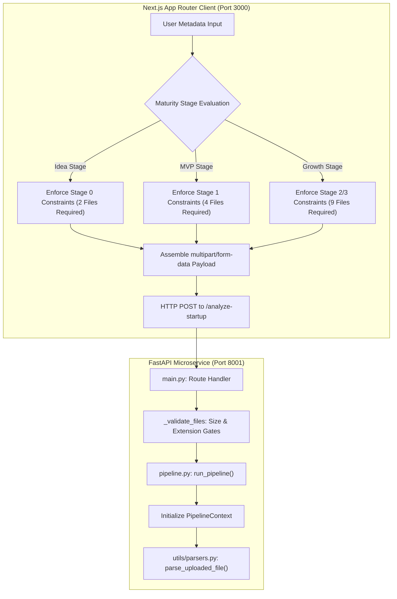

# Fundora Auto DD Engine — Pipeline Flowchart & Function Map

This document provides a comprehensive technical blueprint mapping out exactly how data transforms across the decoupled architecture of the Auto DD Engine, beginning from client-side capture to final validation.

---

## SECTION 1: SYSTEM INGESTION & TYPE COERCION FLOWCHART

Below is the visual and functional map detailing the data flow from the Next.js frontend client to the FastAPI microservice backend.

### 1. Ingestion Flowchart

### 2. Client-Side Node (Next.js Frontend)
- **File & Metadata Capture**: Next.js App Router captures selected files and user input responses.
- **Stage Evaluation**: The client-side state machine computes the startup's maturity (Idea, MVP, Growth).
- **Stage-Adaptive Gating**: Dynamically updates UI form inputs. The "Run DD" button remains disabled until the exact file count rules are satisfied:
  - *Idea*: 2 files minimum (Pitch Deck + Cap Table).
  - *MVP*: 4 files minimum (including KPI sheets/projections).
  - *Growth*: 9 files minimum (including Historical P&Ls, Bank Statements, and GST Returns).
- **FormData Assembly**: Builds a native browser `FormData` object with the files and metadata.
- **API Call Dispatch**: Dispatches an HTTP `POST` request with the `multipart/form-data` payload containing the files to `http://localhost:8001/analyze-startup`.

### 3. Server-Side Node: `POST /analyze-startup` (main.py)
- **Input Capture**: The FastAPI router intercepts the incoming `multipart/form-data` payload.
- **File Validation**: Invokes `_validate_files(files)` to ensure no individual file exceeds 50MB and the aggregate payload does not exceed 200MB, rejecting unsupported extensions.
- **Context Initialization**: Hands execution control to `run_pipeline()` (in `pipeline.py`), which initializes the mutable `PipelineContext` tracking errors, extracted metrics, scores, and raw document segments.

### 4. `parse_uploaded_file()` (utils/parsers.py)
- **File Segregation**: Generates a UUID prefix, saves files to `/tmp_uploads`, and branches parsing logic based on file suffix:
  - `.pdf` ➔ Routes to `parse_pdf_text()` and `parse_pdf_tables()`
  - `.csv` ➔ Routes to `parse_csv()`
  - `.xlsx` / `.xls` ➔ Routes to `parse_excel()`
- **Exception Boundary**: Wrapped in a `try/except` block. Encrypted, empty, or unreadable files append exceptions as strings to the `PipelineContext.errors` array, returning an empty `ParsedDocument` so processing doesn't freeze.

### 5. `parse_pdf_text()` & `_clean_dataframe()` (utils/parsers.py)
- **PDF Extraction**: Extracts text per page using `pdfplumber` (falling back to `fitz` if parsing fails).
  - **Memory Guard**: Clips raw text length to `MAX_PDF_TEXT_LENGTH` (500,000 characters) to prevent OOM spikes.
- **Pandas Data Normalization (`_clean_dataframe`)**:
  - `df.dropna(how="all")`: Removes completely empty rows/columns.
  - `re.sub(r"[₹$€£¥,]", "", s)`: Sanitizes currency symbols.
  - `pd.to_numeric(cleaned, errors="coerce")`: Coerces numeric strings into floats.
  - **JSON Safety Coercion**: Coerces Pandas `NaN` and `NaT` values to standard `None` (`null` in JSON) using `.where(pd.notna(df), None)` to prevent serialization errors during pipeline outputs.

---

## SECTION 2: DYNAMIC STAGE IDENTIFICATION & HEURISTIC MATRIX

**Execution Path: `services/pipeline.py` ➔ `services/stages.py`**

### 1. `calculate_heuristic_stage()`
- **Matrix Logic**: Scans `document_type` properties of parsed files:
  - *If `PITCH_DECK` and `CAP_TABLE` exist ➔ Baseline: Idea Stage.*
  - *If `KPI_SHEET` or `FINANCIAL_PROJECTIONS` exist ➔ Escalates to: MVP Stage.*
  - *If `HISTORICAL_PNL` and `BANK_STATEMENTS` exist ➔ Escalates to: Growth Stage.*
- **Founder Form Override**: Optional client-side metadata overrides (e.g. `declared_arr > 100000`) can escalate stage classification.

### 2. `get_stage_requirements()` & `get_stage_weights()`
- **Requirements Mapping**:
  - `Idea Stage`: `[PITCH_DECK, CAP_TABLE]`
  - `MVP Stage`: `[PITCH_DECK, KPI_SHEET]`
  - `Growth Stage`: `[PITCH_DECK, HISTORICAL_PNL, BANK_STATEMENTS]`
- **Adaptive Weights Mapping**:
  - *Idea Stage Weights*: `{'founder': 40, 'market': 30, 'product': 20, 'financial': 0, 'unit_economics': 10}`
  - *Growth Stage Weights*: `{'founder': 10, 'market': 15, 'product': 15, 'financial': 35, 'unit_economics': 25}`

---

## SECTION 3: DETERMINISTIC FINANCIAL FORMULAS

**Execution Path: `services/pipeline.py` ➔ `services/scoring.py`**

### 1. `calculate_monthly_burn()` & `calculate_runway()`
- **Regex Mapping**: Scans Pandas DataFrames for financial indicators:
  - Burn Rate indicators: `r"operating\s*expense|total\s*outflow|net\s*income"`.
  - Cash Balance indicators: `r"cash\b.*equivalents|closing\s*balance"`.
- **Formulas**:
  - `monthly_burn_rate = abs(sum_of_expenses) / months_in_period`
  - `runway_months = current_cash_balance / monthly_burn_rate` (gracefully resolves division by zero).

### 2. `evaluate_benchmarks()` & `compute_composite_score()`
- **Industry Baselines**: Evaluates margins against standards (e.g. SaaS `GROSS_MARGIN_TARGET` of 70%).
- **Weighted Scoring**:
  1. Ratings from 0-100 are computed for individual categories based on benchmark proximity.
  2. `compute_composite_score()` applies weights derived from `get_stage_weights()`.
  3. Clamps the final `Investment Readiness Score` between 0 and 100.

---

## SECTION 4: DUAL-PROVIDER AI ORCHESTRATION & SAFEGUARD RULES

**Execution Path: `services/pipeline.py` ➔ `utils/llm_orchestrator.py` & `prompts/templates.py`**

### 1. `call_gemini_extraction()` (Layer 2)
- **Model Ingestion**: Instantiates `gemini-1.5-pro` with high context limits to ingest dense PDF/CSV contents.
- **MIME Enforcement**: Configures `response_mime_type="application/json"` to force outputs directly into JSON structure.
- **Extraction Prompts**: Extracts core fields including TAM/SAM/SOM, founder backgrounds, and business models.
- **Anomalies and Auditing**: Cross-checks user inputs and bank records to detect MRR deviations.

### 2. `call_openai_synthesis()` (Layer 5)
- **Synthesis Engine**: Uses GPT-4o to synthesize raw metrics, scores, and Gemini's anomaly insights into investor-ready summaries.
- **Verification Rule**: Checks for inconsistencies. If a large MRR variance is found (e.g., $150k pitch deck vs $50k bank statement), GPT-4o outputs a critical `Red Flag`, sets `mrr_verified: false`, and omits the `confidence_percentage`.

### 3. `LLMOrchestrator._execute_with_retry()`
- **Retry Mechanism**: Implements up to 3 execution attempts.
- **Backoff Algorithm**: Applies `await asyncio.sleep(initial_delay * (2 ** attempt))` to handle API rate limits and network degradation.

---

## SECTION 5: FINAL SYSTEM VALIDATION SCHEMA

**Execution Path: `utils/llm_orchestrator.py` ➔ `models/schemas.py` ➔ `main.py`**

### 1. Pydantic Verification
The final output is parsed and verified against the `AutoDDResponse` Pydantic model:
- `executive_summary`: contains `detected_stage` and `classification_confidence_score`.
- `scores`: validates sub-scores and Clamps composite Investment Readiness Score (0-100).
- `insights`: enforces lists of strengths and red flags.
- `verification`: enforces boolean check for `mrr_verified` and optional confidence scoring.

### 2. Response Delivery
The validated response is converted to JSON and returned as an `HTTP 200 OK` payload to the client interface.
